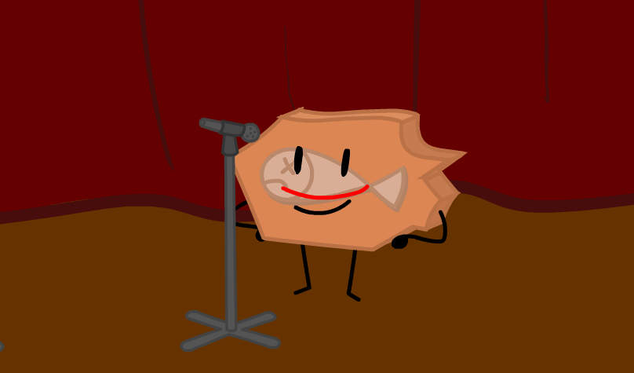

> "Dans mon esprit tout divague..."

I've been experimenting a bit with a new lip sync method that would look better since I way always bad at animating lip syncs.

For example:

Here is my work from May 2024 when I worked on [BFGC](https://www.youtube.com/playlist?list=PLHZQQqIoYvHeQ30WpQX1zLTW1U4NneE1Q) [Episode 2](https://www.youtube.com/watch?v=MWDASsxXRAA)

>"Yeah, I think it pretty good and you should like it"

> "It's not that bad, and a decent size too!"

I hated lip syncing because I didn't really know HOW should I lip sync. I watched that one [WebzForevz Youtube Tutorial on animation](https://www.youtube.com/watch?v=OBnBtwxVBZU) and I tried to follow it to the letter.

Those two animations are the result of that method and, let's be honest, they look awful.

Now that I think about it, it probably wasn't the method itself but my understanding of it, which was rather poor.

I was VERY UNHAPPY. My time seemed wasted if the work I made did not meet my expectations.

Then I decided to experiment a bit and think about what I'm actually trying to do.

The first thing I figured out lip sync is about animating the lips and not the mouth. So when I'm animating lips I should first focus on their shape size and location. 

The second thing I figured out is that if I want it to look realistic the lip sync should look human. The upper lip should move as little as possible and the lower lip should do most of the movement.
The upper jaw SHOULDN'T MOVE AT ALL.

(Upper jaw is indicated by the red line)

So when animating the lip movement the upper teeth musn't change their position or they would otherwise break the illusion. 

It's interesting because that's exactly how the human jaw works and I'm trying to copy that. 

> "Dans mon esprit tout divague..."
