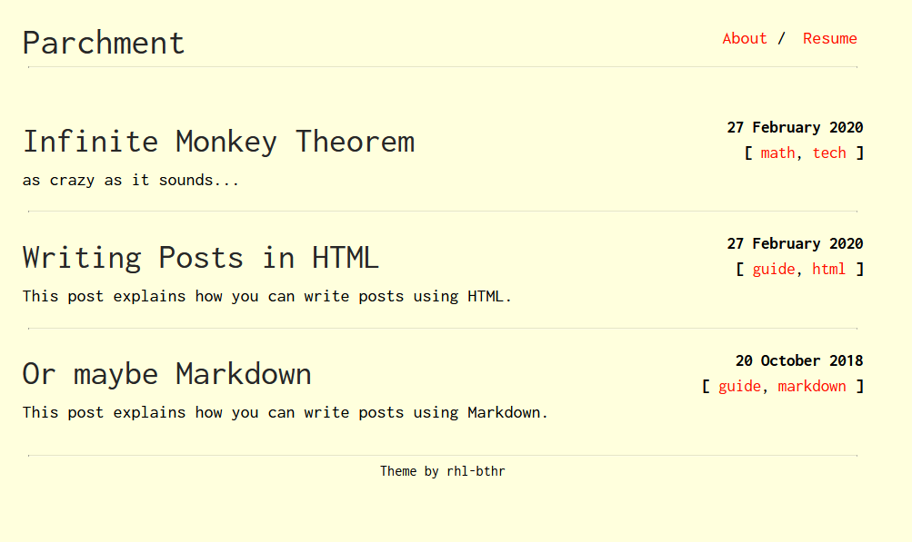

NOTE:

So, I usually don't do any Animation/Drawing/Directing on Fridays for personal reasons.

No, I'm not a Muslim, I'm just more tired on Friday than I am on any other day. 

I usually don't do anything productive during my free time on Fridays.

Not really sure why

`¯\_(ツ)_/¯

So Immna do a Roundup!

---

### WORK I DID THIS WEEK:

#### Miscellaneous

* Finished reading [a book](https://en.wikipedia.org/wiki/The_Fountainhead)
* Started [This Very](https://akzolon.github.io/Journal/) Journal

Original Template Design

#### Animation

* Figured out how to [[2025-04-08-Perdue-Walk-Cycle|Animate a walk cycle]]
* Made a flower asset for the Animation
* Started [[2025-04-09-Lip-Syncing-Part-1|Lip syncing Fossil]]

#### Gaming

* BBQ-ed some Dreams with [ƎNA](https://store.steampowered.com/app/2134320/ENA_Dream_BBQ/)

### WORK *that I really wish I did* THIS WEEK:

* Got back to my old screenplay
* Got back to drawing
* Organised my time better