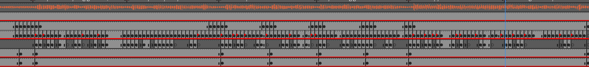
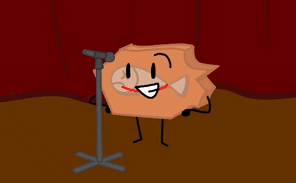

So Today:

I started reading [another book](https://en.wikipedia.org/wiki/Cheese_(novel))

and

I lip synced Fossil 

*Ugh*

and I'm still not finished... 
I'm only halfway done

Don't get me wrong, It was fun to animate, but right now, writing this, I feel tired.

So I'm still following the method I outlined in the [Previous post on the subject](https://akzolon.github.io/Journal/2025-04-09-Lip-Syncing-Part-1/)
It looks something like this:

Note that the red line there is just for reference and it wont be in the final render.

All in all, I'm pretty happy with how the animation is going so far. 