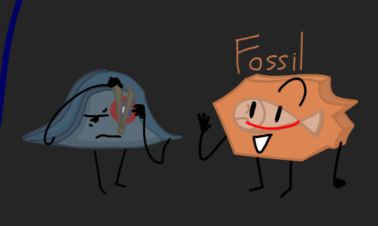
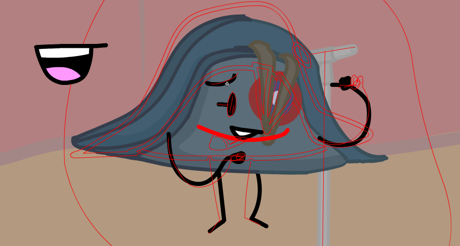

Good news and bad news:

Good News:
I have finished lip syncing Fossil for that animation scene I'm working on

Bad News:
I have Springtime lethargy  

> April is the cruellest month, breeding  
> Lilacs out of the dead land, mixing  
> Memory and desire, stirring  
> Dull roots with spring rain.

- T. S. Eliot, _The Waste Land_

---
# The Good news

I have finished lip syncing Fossil and I have moved on to Perdue (The French hat)

Even though I had the whole day free, I only lip synced the first line.

Fr:
> "Dans mon esprit tout divague"

En:
> "In my mind, everything goes wild"

I guess that's an accurate representation of my sleep.

Since every mouth is hand drawn I drew a floating mouth next to Perdue to use as a reference for colour.

It's helpful. Adobe Animate can be weird at times.

---
# The Bad news

I am unnaturally tired
and I hate it...

I hate having Springtime lethargy 
Most specifically It's symptoms

I am ***much*** more tired. 
However I can still think... and 

I'm not as productive in my personal labours as I COULD HAVE BEEN if I were not dead tired.
I'm unhappy because I can't really do the things I enjoy doing. 

Today I have slept during the day for 3 hours straight.
I never sleep during the day.
Fever dreams are always fun.

I'm still doing my obligated labours since I don't have much of a choice.
I hope this ends soon.

