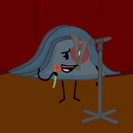

Ugh yeah
I'm okay

# Old news first

I finished Lip Syncing Perdue

:D

Here's the final result:

It looks much better than I hoped it would...
and for that I'm happy

I like this more realistic style of lip sync where the mouth moves less violently.
I think I should use it more, I don't know. It just looks better to me.

# New news next

I got back into Music making

BLEGH,
it was a mess...
but I made something

I'm still not sure if that's something I want to pursue on the same level as I am doing rn to animation...

I don't know

I've made a full song

I am probably going to upload it to Newgrounds later

If I don't foget

