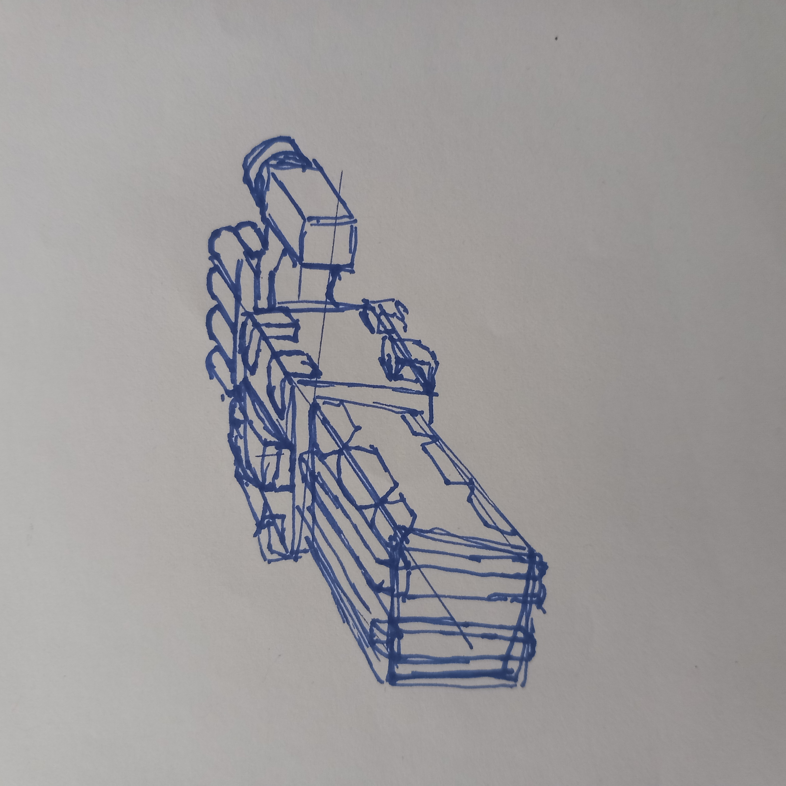

Well, this will be my fifth attempt

Have I learned anything in those four prevoius attempts? I... I don't know... 

**First attempt** was in *August 2023*. I was drawing other people's minecraft skins. It was some sort of Nation RP server I was participating in. It took away most of my time during the years of 2022-2023. I was also still drawing countryballs during that time. I eventually stopped drawing in *October 2023* and moved to music production and animating. I started working on [The Magician](https://youtu.be/w4l25xpmrhc?si=cQsxlAriOSB1x3j2) about that time
*8/"23 - 10/"23*

In between I started animating, producing music and writing. 
(2 month break)

**Second attempt** was in *December 2023*. I became motivated after watching that one [Pewdiepie's video on drawing](https://www.youtube.com/watch?v=CMLEudGbxQk). I focused mostly on anime style since I wanted to draw that...I guess [Oridays](https://www.youtube.com/@oridays) had some influence here too... I've found a free figure drawing video series online and I started to follow it. I soon realised that it was way too complex for me and I decided to focus on gesture drawing. After drawing 100 gestures I lost interest again... That was around *January 2024*. At that time I finished beating the story of Sunless Lands. 
*12/"23 - 1/"24*

*In between I focused an animating in AA, figuring out how blender works, and writing an outline for the story of "Sunless Lands"* 
(5 month break)

**Third attempt** was made in *June 2024*. I started drawing poes again and then pivoted to studying from a book I found. "Dynamic bible". It offered the most fundamental of fundamental lessons on art that I could found. So I followed it. I started drawing fully traditional and with a fineliner pen. Circles, elipses, boxes, cones, tubes. I went back to gesture drawing and I drew an additional 100 poses (in much better quality than last time). After that I tried to figure out how the pelvis and ribcage fit in space. I had next to no success. I went back to that free figure drawing video series I found. While I did manage to get further than last time and my figure drawings were more 3d and better looking than last time, *the more I practiced and went further, the less 3d coherent my drawings became*. I finished watching the video and doing the exercises about the head and then I moved to do the exercise that focused on the body. The drawings of the body that came out ware so 3d discoherent that I gave up. I clearly still DID NOT UNDERSTAND how three dimensional forms function in space. In *August 2024* decided to take a break. 
6/"24 - 8/"24

*I didn't do anything during this time.*
(2 month break)

**Fourth attempt** was made in *October 2024* when I discovered Drawabox. I went through Lesson 0, 1 and 2. It took some time. But I think was pleased with the prgress I made. I took a two week break from drawing until late January 2025. I found on youtube the full "Dynamic sketching" video series and decided to follow it. I finished week 1, 2 and 3. I was drawing boxes again. Then I just stopped. I wasn't tired and I wasn't burned out. I don't really know why... I think I found no reason to continue drawing, no internal motivation, no real creative will. I have some stories I've written (Sunless Lands) but I've never really found any real desire to illustrate them. 

Have I been trying to do something I don't really want? 
I do not know. 

It does hurt me to not know what exactly I want out of drawing.

Hey, 
Atleast I'm having fun drawing spaceships :)

