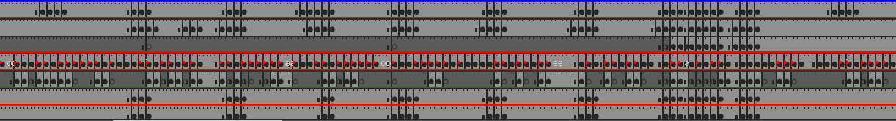

Good news.

I'm halfway done with character animation

So that's nice :)

Here's my Adobe Animate Scene Animation pipeline

1. ~~IDEA 

2. ~~STORYBOARDING 

3. ~~SCENE SET-UP (SCENE RIGGING)

4. ~~KEY POSES EYES+BODY+LEGS (ALL AT ONCE)==

5. ~~KEY POSES ARMS 

6. ~~ANIMATING EYES 

7. ~~ANIMATING LIP SYNC 

8. ANIMATING BODY MOVEMENT ==W.I.P==

So yeah I'm almost there. Almost finished working in AA. After AA I'll move to AE for the special effects and stuff...

Here's how it looks:

Looking at it now, yeah I'm happy with what I did.

I also made a new song, but I'll talk more about that in another post :)